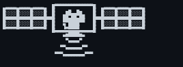

# 🌿 AL HOTIMSKI

**`Environmental Data Scientist / Avid Urbanist / Watercolor Enthusiast`** 

Geospatial Data Scientist at The Conservation Fund. Remote sensing, ownership records, and the pipelines that connect them.

- 🔭 I'm currently working on [**cogsieve**](https://github.com/ahotimski00/cogsieve), a Python library for filtering polygons by fractional coverage of remote categorical rasters
<!--- 🌱 I'm currently learning **cloud dev**  -->
- 💬 Ask me about **GIS, GEE, Remote Sensing**

---

<h3 align="left"> Portfolio: <a href="https://ahotimski00.github.io" target="_blank" rel="noreferrer">ahotimski00.github.io ↗</a> </h3>
<h3 align="left"> LinkedIn: <a href="https://www.linkedin.com/in/al-hotimski/" target="_blank">al-hotimski ↗</a> </h3>

---

<!--
### ⚙️ Languages, Tools, Software

 
-->

<!-- to do: add stats, add projects, color grad. -->

